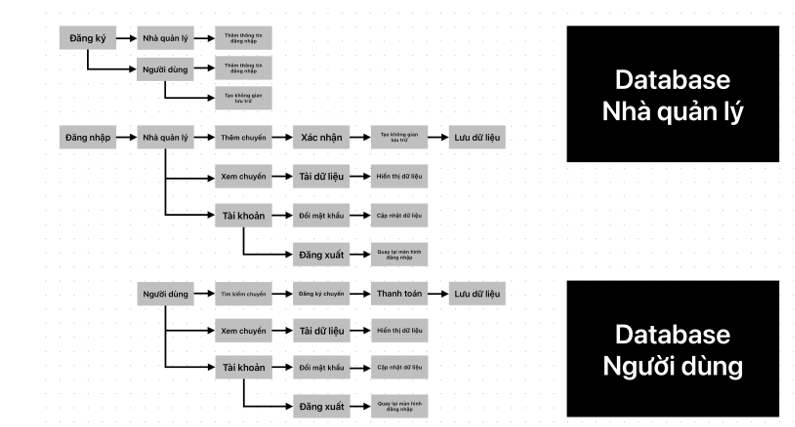

# Quan-ly-chuyen-bay

Đây là bản chưa có giao diện Java swing và database

IDE sử dụng là IntelIJ

Chương trình gồm những tính năng cơ bản để quản lý chuyến bay và staff

- Thêm
- Sửa
- Xóa
- Lọc theo yêu cầu
- Sắp xếp theo tiêu chí

Phiên bản này chưa cập nhật tính năng dành cho tài khoản khách, tài khoản admin có thẻ tìm thấy ở hàm **login()**
Vui lòng bỏ thêm tiền để có full source về nộp bài tập lớn 🐧 hoặc tự đem về phát triển thêm 

    <button id="ok" style="    #ok{
        padding: 10px;
        width: 150px;
        font-weight: bold;
        font-size: 30px;
        color: white;
        background-color: rgb(99, 218, 99);
        border: none;
        border-radius: 5px;
    }    #ok:hover{
        margin-left: 500px;
        transition: all 5s;
        background-color: brown;
        color:gold;
    }">Ok</button>
